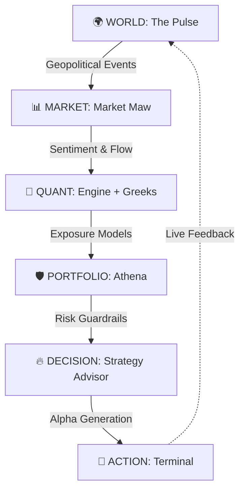

🔱 QuantSuite: The Connected Intelligence OS

> "Winning is everything. Money is the oxygen of the system. QuantSuite is the machine that provides the oxygen."

QuantSuite isn't a "tool." It's the **operating system of financial dominance**. It is a unified, high-octane intelligence layer that connects global geopolitical volatility to institutional-grade execution.

## ⚡ THE CORE THESIS
Markets are not isolated events. They are sentient systems reacting to a connected world. Existing tools show you data; QuantSuite shows you **how the world moves the market**.

## 🧬 SYSTEM ARCHITECTURE (INSTITUTIONAL GRADE)



## 🛠️ MODULES OF DOMINANCE

### 🔴 THE PULSE (World-to-Market Engine)
Real-time, vertically-integrated intelligence feed. Maps conflict zones, trade route disruptions, and central bank shifts directly to asset class volatility.

### 🐊 MARKET MAW (Deep Liquid Flow)
FinBERT-powered sentiment analysis. It doesn't just read the news; it feels the institutional heat. Captures flows before they hit the retail tape.

### 🛡️ ATHENA (The Iron Guard)
Institutional Risk Management. VaR, CVaR, Monte Carlo simulations, and factor decomposition. Athena protects your capital with a zero-tolerance policy for sloppy risk.

### 🔥 STRATEGY ADVISOR (Alpha Factory)
Quant-based strategy generation. Cold, surgical, and execution-obsessed. Generates backtestable Python code for regimes that most traders fear.

## 🚀 DEPLOYMENT

### STANDALONE SETUP
1. **Clone the machine**:
   ```bash
   git clone [REDACTED]
   ```
2. **Ignite the dependencies**:
   ```bash
   npm install --legacy-peer-deps
   ```
3. **Launch the Engine**:
   ```bash
   npm run dev
   ```

### ENVIRONMENT SECURITY
The machine requires the following high-security keys in your `.env` or Supabase secrets:
- `SYSTEM_AI_API_KEY`: The brain behind the intelligence.
- `SUPABASE_SERVICE_ROLE_KEY`: Institutional access layer.

---
**QuantSuite © 2026. FOR THE 1% WHO DECIDE THE FUTURE.**
*"Most traders are deaf. QuantSuite makes you hear everything."*
