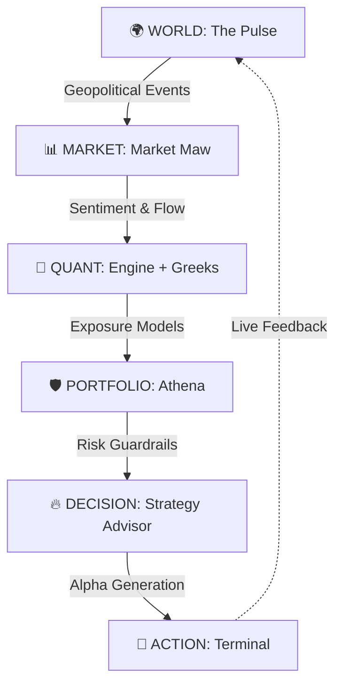

# 🔱 QuantSuite: The Connected Intelligence OS

> "Winning is everything. Money is the oxygen of the system. QuantSuite is the machine that provides the oxygen."

QuantSuite isn't a "tool." It's the **operating system of financial dominance**. It is a unified, high-octane intelligence layer that connects global geopolitical volatility to institutional-grade execution.

## ⚡ THE CORE THESIS
Markets are not isolated events. They are sentient systems reacting to a connected world. Existing tools show you data; QuantSuite shows you **how the world moves the market**.

## 🧬 SYSTEM ARCHITECTURE (INSTITUTIONAL GRADE)



## 🛠️ THE ARSENAL: CORE FEATURES

### 🔴 THE PULSE (World-to-Market Translation)
- **Geopolitical Heatmap**: Real-time global risk visualization tracking conflict zones, trade routes, and natural disasters.
- **Institutional Event Feed**: Deterministic engine mapping world events directly to asset class volatility (Semiconductors, Defense, Tech, Energy).
- **Dynamic Risk Adjustment**: Automated risk-weighting based on regional instability and central bank shifts.

### 📊 MARKET MAW (Sentiment & Liquid Flow Analysis)
- **FinBERT Intelligence**: Real-time sentiment extraction from global news terminals.
- **Institutional Flow Tracking**: Visualizing "smart money" movement before it hits the retail tape.
- **Volatility Surface Models**: Deep-dive analysis of market fear and greed across timeframes.

### 🧠 QUANT ENGINE (Advanced Analytics)
- **Black-Scholes OS**: Institutional-grade options pricing with real-time Greek sensitivity.
- **Monte Carlo Simulations**: 10,000+ path simulations for probability of profit (PoP) modeling.
- **Binomial Tree Visualizer**: Step-by-step American option exercise modeling.
- **SVI Model Integration**: Stochastic Volatility Inspired models for fitting the volatility smile.

### 🛡️ ATHENA (Portfolio Risk Management)
- **Institutional VaR/CVaR**: Parametric and historical Value at Risk analysis for large AUM.
- **Factor Decomposition**: Beta, momentum, value, and volatility exposure breakdowns.
- **Regime Detection**: Automated classification of market environments (Bull/Bear/Sideways).
- **Stress-Testing**: One-click "Black Swan" simulation across the entire portfolio.

### 🔥 STRATEGY ADVISOR (The Alpha Factory)
- **Natural Language to Code**: Convert complex trading ideas into backtestable Python (pandas/numpy) scripts.
- **Kelly Criterion Sizing**: Mathematically optimized position sizing for long-term survival.
- **Hedge Generator**: Automated generation of optimal tail-risk hedging strategies (Stops, Spreads, Strangles).

### 🔍 ARBITRAGE DETECTOR
- **Cross-Market Scanners**: Real-time detection of Put-Call Parity violations and synthetic mispricing.
- **Execution Risk Modeling**: Accounting for slippage, commissions, and latency before the trade is suggested.

### 📜 QUANTSCRIPT (The Control Layer)
- **DSL for Quants**: A domain-specific logic layer that allows for rapid automation of multi-step intelligence flows.

## 🚀 DEPLOYMENT

### STANDALONE SETUP
1. **Clone the machine**:
   ```bash
   git clone [REDACTED]
   ```
2. **Ignite the dependencies**:
   ```bash
   npm install --legacy-peer-deps
   ```
3. **Launch the Engine**:
   ```bash
   npm run dev
   ```

### ENVIRONMENT SECURITY
The machine requires the following high-security keys in your `.env` or Supabase secrets:
- `SYSTEM_AI_API_KEY`: The brain behind the intelligence.
- `SUPABASE_SERVICE_ROLE_KEY`: Institutional access layer.

---
**QuantSuite © 2026. FOR THE 1% WHO DECIDE THE FUTURE.**
*"Most traders are deaf. QuantSuite makes you hear everything."*

