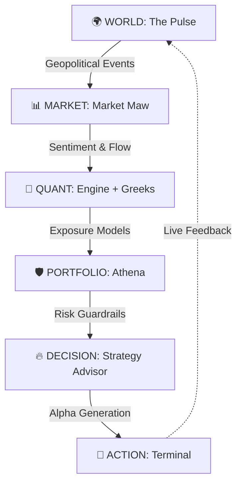

deploy/quantsuite-institutional
# 🔱 QuantSuite: The Connected Intelligence OS

> "Winning is everything. Money is the oxygen of the system. QuantSuite is the machine that provides the oxygen."

QuantSuite isn't a "tool." It's the **operating system of financial dominance**. It is a unified, high-octane intelligence layer that connects global geopolitical volatility to institutional-grade execution.

## ⚡ THE CORE THESIS
Markets are not isolated events. They are sentient systems reacting to a connected world. Existing tools show you data; QuantSuite shows you **how the world moves the market**.

## 🧬 SYSTEM ARCHITECTURE (INSTITUTIONAL GRADE)



## 🛠️ THE ARSENAL: SYSTEM MODULES

### 🕹️ CORE COMMAND
- **Command Center**: The primary cockpit for global market oversight and system status.
- **Pulse**: Real-time world-to-market translation engine. Tracks geopolitical risk, trade routes, and conflict zones with live impact mapping.

### 🧠 INTELLIGENCE SUITE (AI TOOLS)
- **Athena AI**: The Chief Risk Officer. Institutional VaR, factor decomposition, and tail-risk stress testing.
- **Market Maw**: Sentiment and liquid flow analysis. Feels the institutional heat before it hits the tape.
- **AI Strategy Advisor**: Natural language to quantitative strategy engine. Pure, backtestable alpha.
- **Quant Engine**: The mathematical brain for complex derivative modeling and Greek sensitivity.
- **Advisor**: Institutional knowledge base and strategic guidance terminal.

### 💹 MARKET & TRADING
- **Stock Report**: Deep-dive institutional equity analysis and scoring.
- **Market Terminal**: Professional-grade execution environment and live data stream.
- **Stock Screener**: High-performance filtering engine for identifying institutional setups.

### 🛡️ PORTFOLIO MANAGEMENT
- **My Portfolios**: Unified view of institutional allocations and multi-asset exposure.
- **Portfolio Builder**: Dynamic construction engine for optimized asset weighting.
- **Portfolio Optimizer**: Mean-variance and risk-parity optimization modules.
- **Alpha Signals**: Proprietary signal generation across global equity and derivative markets.
- **Walk-Forward Test**: Robust validation of strategies across out-of-sample data regimes.
- **Backtest History**: Comprehensive audit log of strategy performance and decay.
- **Risk Analysis**: Multi-dimensional risk reporting and concentration detection.
- **CSV Visualizer**: Instant institutional visualization for external raw data feeds.

### 📐 PRICING MODELS (DERIVATIVES OS)
- **Institutional Calculator**: Precise Black-Scholes and Binomial implementation.
- **Advanced Greeks**: Second and third-order sensitivity analysis (Vanna, Charm, Vomma).
- **Binomial Tree**: Discrete-time modeling for American and exotic options.
- **Monte Carlo**: 10,000+ path simulations for complex probability distributions.
- **SVI Model**: Stochastic Volatility Inspired models for perfect smile fitting.
- **Heston Model**: Stochastic volatility modeling for institutional displacement.
- **Jump Diffusion**: Modeling market shocks and discontinuous price action.

### 🔍 ANALYSIS TOOLS
- **Technical Indicators**: High-performance library of institutional momentum and flow indicators.
- **Volatility Solver**: Automated surface construction and regime detection.
- **Credit Risk Models**: Modeling counterparty and default risk across credit cycles.
- **Arbitrage Detector**: Real-time scanner for Put-Call Parity and cross-exchange inefficiencies.
- **Scenario Analysis**: "What-if" modeling for major market dislocations and economic shifts.
- **Earnings Calendar**: Institutional event tracking with predicted volatility impact.

### 🚀 STRATEGY & INSIGHT
- **Strategy Builder**: The low-code factory for institutional logic deployment.
- **Educational Insight**: Deep-dive theory and implementation guides for professional quants.
- **Insider Street**: Tracking institutional flows, dark pool prints, and regulatory filings.

## 🏁 DEPLOYMENT

### STANDALONE SETUP
1. **Clone the machine**:
   ```bash
   git clone [REDACTED]
   ```
2. **Ignite the dependencies**:
   ```bash
   npm install --legacy-peer-deps
   ```
3. **Launch the Engine**:
   ```bash
   npm run dev
   ```

### ENVIRONMENT SECURITY
The machine requires the following high-security keys in your `.env` or Supabase secrets:
- `SYSTEM_AI_API_KEY`: The brain behind the intelligence.
- `SUPABASE_SERVICE_ROLE_KEY`: Institutional access layer.

---
**QuantSuite © 2026. FOR THE 1% WHO DECIDE THE FUTURE.**
*"Most traders are deaf. QuantSuite makes you hear everything."*
=======
# 🔱 QuantSuite: The Connected Intelligence OS

> "Winning is everything. Money is the oxygen of the system. QuantSuite is the machine that provides the oxygen."

QuantSuite isn't a "tool." It's the **operating system of financial dominance**. It is a unified, high-octane intelligence layer that connects global geopolitical volatility to institutional-grade execution.

## ⚡ THE CORE THESIS
Markets are not isolated events. They are sentient systems reacting to a connected world. Existing tools show you data; QuantSuite shows you **how the world moves the market**.

## 🧬 SYSTEM ARCHITECTURE (INSTITUTIONAL GRADE)


## 🛠️ THE ARSENAL: SYSTEM MODULES

### 🕹️ CORE COMMAND
- **Command Center**: The primary cockpit for global market oversight and system status.
- **Pulse**: Real-time world-to-market translation engine. Tracks geopolitical risk, trade routes, and conflict zones with live impact mapping.

### 🧠 INTELLIGENCE SUITE (AI TOOLS)
- **Athena AI**: The Chief Risk Officer. Institutional VaR, factor decomposition, and tail-risk stress testing.
- **Market Maw**: Sentiment and liquid flow analysis. Feels the institutional heat before it hits the tape.
- **AI Strategy Advisor**: Natural language to quantitative strategy engine. Pure, backtestable alpha.
- **Quant Engine**: The mathematical brain for complex derivative modeling and Greek sensitivity.
- **Advisor**: Institutional knowledge base and strategic guidance terminal.

### 💹 MARKET & TRADING
- **Stock Report**: Deep-dive institutional equity analysis and scoring.
- **Market Terminal**: Professional-grade execution environment and live data stream.
- **Stock Screener**: High-performance filtering engine for identifying institutional setups.

### 🛡️ PORTFOLIO MANAGEMENT
- **My Portfolios**: Unified view of institutional allocations and multi-asset exposure.
- **Portfolio Builder**: Dynamic construction engine for optimized asset weighting.
- **Portfolio Optimizer**: Mean-variance and risk-parity optimization modules.
- **Alpha Signals**: Proprietary signal generation across global equity and derivative markets.
- **Walk-Forward Test**: Robust validation of strategies across out-of-sample data regimes.
- **Backtest History**: Comprehensive audit log of strategy performance and decay.
- **Risk Analysis**: Multi-dimensional risk reporting and concentration detection.
- **CSV Visualizer**: Instant institutional visualization for external raw data feeds.

### 📐 PRICING MODELS (DERIVATIVES OS)
- **Institutional Calculator**: Precise Black-Scholes and Binomial implementation.
- **Advanced Greeks**: Second and third-order sensitivity analysis (Vanna, Charm, Vomma).
- **Binomial Tree**: Discrete-time modeling for American and exotic options.
- **Monte Carlo**: 10,000+ path simulations for complex probability distributions.
- **SVI Model**: Stochastic Volatility Inspired models for perfect smile fitting.
- **Heston Model**: Stochastic volatility modeling for institutional displacement.
- **Jump Diffusion**: Modeling market shocks and discontinuous price action.

### 🔍 ANALYSIS TOOLS
- **Technical Indicators**: High-performance library of institutional momentum and flow indicators.
- **Volatility Solver**: Automated surface construction and regime detection.
- **Credit Risk Models**: Modeling counterparty and default risk across credit cycles.
- **Arbitrage Detector**: Real-time scanner for Put-Call Parity and cross-exchange inefficiencies.
- **Scenario Analysis**: "What-if" modeling for major market dislocations and economic shifts.
- **Earnings Calendar**: Institutional event tracking with predicted volatility impact.

### 🚀 STRATEGY & INSIGHT
- **Strategy Builder**: The low-code factory for institutional logic deployment.
- **Educational Insight**: Deep-dive theory and implementation guides for professional quants.
- **Insider Street**: Tracking institutional flows, dark pool prints, and regulatory filings.

## 🏁 DEPLOYMENT

### STANDALONE SETUP
1. **Clone the machine**:
   ```bash
   git clone [REDACTED]
   ```
2. **Ignite the dependencies**:
   ```bash
   npm install --legacy-peer-deps
   ```
3. **Launch the Engine**:
   ```bash
   npm run dev
   ```

### ENVIRONMENT SECURITY
The machine requires the following high-security keys in your `.env` or Supabase secrets:
- `SYSTEM_AI_API_KEY`: The brain behind the intelligence.
- `SUPABASE_SERVICE_ROLE_KEY`: Institutional access layer.

---
**QuantSuite © 2026. FOR THE 1% WHO DECIDE THE FUTURE.**
*"Most traders are deaf. QuantSuite makes you hear everything."*
main
